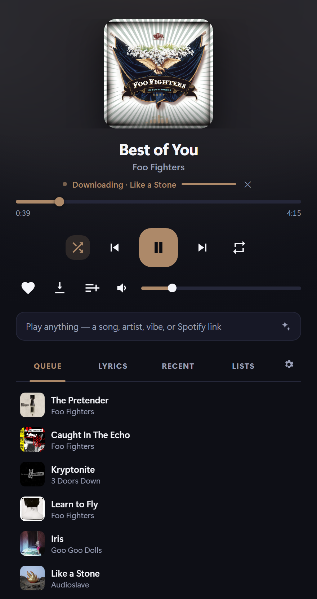
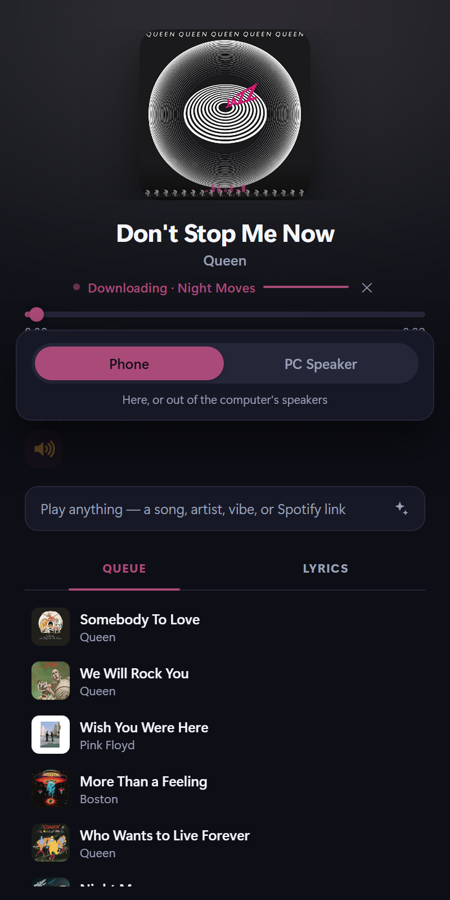
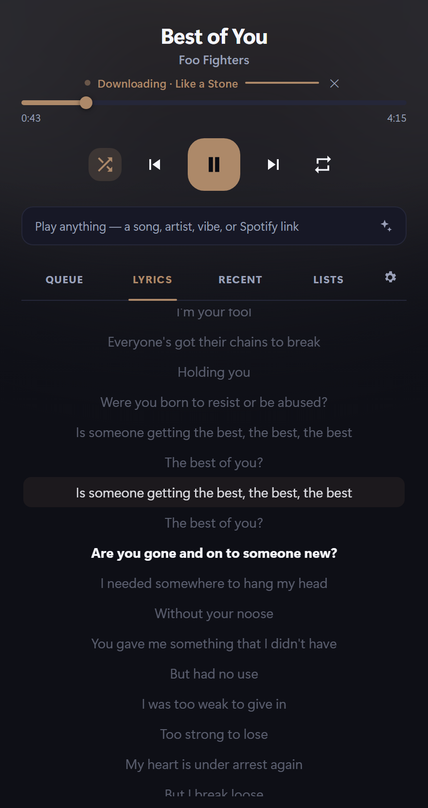
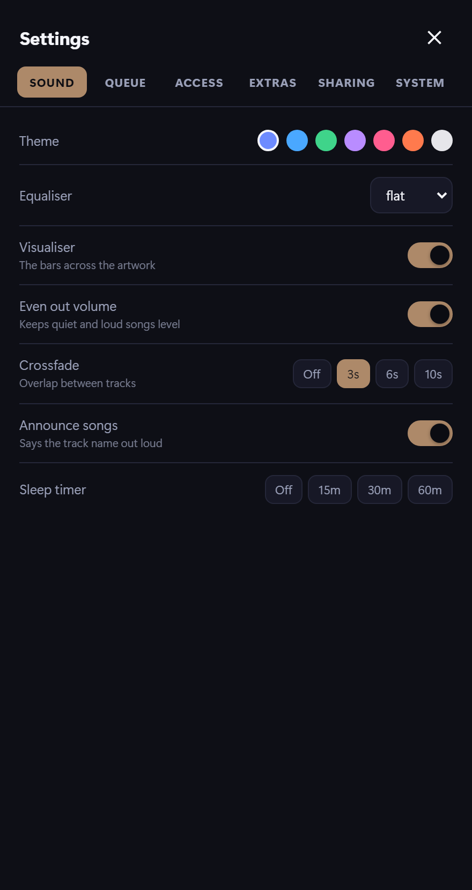
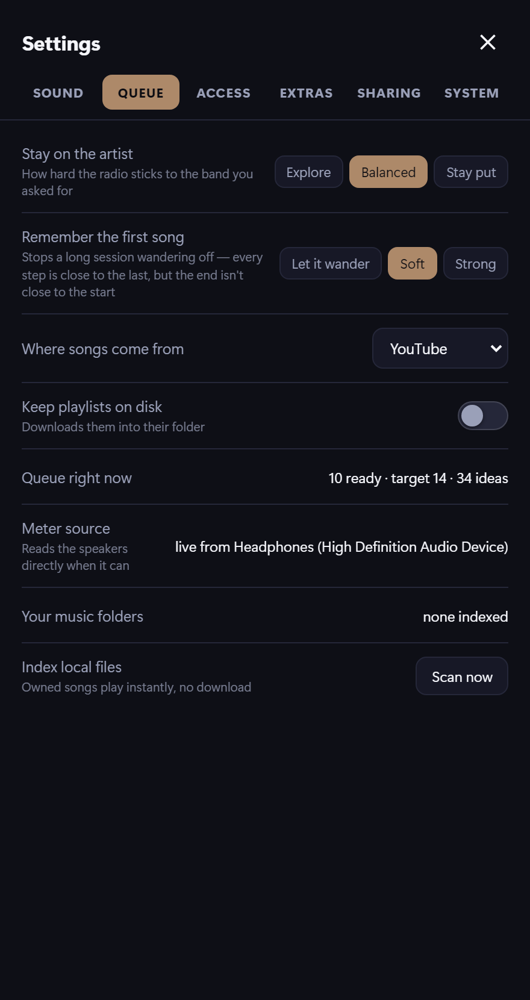

# Music Request Server

A local network music playback server that streams from YouTube Music through HTTP API, Siri voice commands, Shortcuts, and a web interface. No local music library required — every request is resolved by searching YouTube Music with `ytmusicapi` and played by `mpv`.

<p align="center">
  
  
</p>

Ask for a song, an artist, an album or a vibe and it works out what comes next
— on the left. Hand somebody a link and they get their own queue on their own
phone, without touching yours — on the right.

<details>
<summary>More of it</summary>

<p align="center">
  
  
  
</p>
</details>

## A few things it does that aren't obvious

**Ask for a playlist out loud.** "Make me a thirty minute grunge playlist",
"a two hour playlist of Nirvana and Soundgarden", "half an hour of jazz and
blues", "a playlist like Bohemian Rhapsody". The length can be counted or
said; the subject can be one genre, several, one band, several, or a single
record to build around. It fills to the length asked for, one act at a time
rather than five songs by the first one, and files it under a sensible name.

**About this song.** The ⓘ beside the settings gear — or the
Lyrics / About switch, on a screen wide enough to give the words their own
column — swaps the lyrics for where the record came from. Wikipedia's
background section and Last.fm's write-up, never anything invented: the
model that shortens them is only allowed to use what those said.

**Shared playlists.** Press ⇄ on one of your lists and everyone holding a
link can see it, play it and add to it. There is one copy — the house is
looking at the same list, and each row says who put it there. People can
take back their own additions and nothing else, and the list stays yours to
delete. Even a link that expires can put a song in one, because the list
outlives the evening.

**The volume follows the clock.** Quieter after eleven, eased off after
eight, back up at seven. The level you set is remembered as the level you
meant for that time of day, so turning it up at midnight makes midnight
louder rather than starting an argument. One toggle in settings turns it off.

## Playing somewhere else

The whole player runs in a browser, so anything with one is a speaker.

- **Your own phone.** The capsule at the top of the output picker moves the
  sound between this computer and the device you're holding. The song and the
  position come with you; it doesn't start again.
- **Somebody else's phone.** Make them a link in **Settings → Sharing**. A
  *phone-only* link plays on their device and nowhere else; a *full* link can
  also drive the computer's speakers. Either way they get their own queue,
  their own history and their own radio — they never see yours, and nothing
  they play reaches your Recently Played or your Last.fm.
- **Take it back.** Every link is named and revocable, one at a time or all at
  once. The list shows who's listening, to what, and how much they've asked
  for.

Links are signed passes rather than the key itself, they expire, and three
wrong guesses from one address earns a 24-hour ban.

### On a computer

Open any link in a browser window wider than 900px and the player rearranges
itself rather than stretching: the queue becomes a column down the right that
stays visible while you use the rest of it, the cover takes the height it's
given, and the search box moves to the top. The tray flyout stays the narrow
bar it's meant to be — **right-click the tray icon → Open desktop player** to
get the wide one on this machine.

A link playing on a laptop also gets the volume slider, which used to be
hidden from every link on the assumption that "playing on your own device"
meant a phone with hardware buttons.

## Quick Start

### Option 1 — download the release (no Python needed)

1. Grab the latest `MusicRequestServer-windows.zip` from the
   [Releases page](https://github.com/KDMurray0/siri-to-pc/releases) and unzip it anywhere.
2. Right-click `setup.ps1` → **Run with PowerShell** (or from a terminal):

   ```powershell
   powershell -ExecutionPolicy Bypass -File setup.ps1
   ```

   It installs mpv, yt-dlp and Node.js via winget, then sets up your YouTube
   cookies and verifies a real download works.
3. Run `MusicRequestServer.exe`. It lives in the system tray.

### Option 2 — run from source

```powershell
git clone https://github.com/KDMurray0/siri-to-pc
cd siri-to-pc
powershell -ExecutionPolicy Bypass -File setup.ps1
```

`setup.ps1` also installs the Python packages and writes `src\config.json` for
you. Then double-click **`launcher.pyw`** (server + tray player), or run the
server on its own:

```bash
python src/app.py
```

If `api_key` is blank or missing, a random secret is generated on first run.
Open `http://<pc-ip>:5000/` to see the endpoint URL (with the key) and the Siri
Shortcut steps.

### What setup.ps1 does

| Step | Detail |
|------|--------|
| Prerequisites | Installs `mpv`, `yt-dlp`, `Node.js` via winget; skips anything already present |
| Python packages | `pip install -r requirements.txt` (source runs only — the .exe bundles them) |
| Config | Creates `src\config.json` from the example, sets `python_path`, `js_runtime`, `player_client` |
| Cookies | Tries `--cookies-from-browser` against each installed browser, falls back to a cookies file |
| Verify | Runs a real YouTube fetch and reports exactly what failed if anything did |

Useful flags: `-SkipCookies` (tools only), `-CookieBrowser firefox` (skip auto-detection).

### Build the .exe yourself

One command. Runs the checks, builds, closes the running copy, installs over
`dist\MusicRequestServer`, and starts it again:

```powershell
.\build.ps1
```

`-NoRestart` leaves it closed, `-CheckOnly` just runs the checks, and
`-SkipChecks` goes straight to building. It stages the build in `%TEMP%`
first because a running exe holds a lock on its own folder.

By hand, if you'd rather:

```bash
pip install pyinstaller
pyinstaller --noconfirm MusicRequestServer.spec
```

Then check the thing you actually built, which the test suite never sees:

```
dist\MusicRequestServer\MusicRequestServer.exe --selftest
```

It boots the server inside the bundle, renders the player, calls ten
endpoints, loads every store and parses a spoken phrase — the failures that
only exist frozen, like a hidden import PyInstaller didn't spot or a template
it didn't collect. Non-zero exit if anything is wrong.

**Run the `dist` folder, not `build`.** PyInstaller creates both:

| Folder | What it is |
|--------|------------|
| `dist\MusicRequestServer\` | **The actual app.** Run `MusicRequestServer.exe` from here. This is what ships. |
| `build\` | Scratch working files from the compile. Nothing to run; safe to delete anytime. |

mpv, yt-dlp and Node still need to be on PATH — run `setup.ps1` on the target
machine to handle that.

## Prerequisites

> `setup.ps1` installs all of these for you — this list is what it does, and what
> to install by hand if you would rather.

- **mpv** media player (audio-only mode): `winget install --id shinchiro.mpv -e`
- **yt-dlp** (audio fetcher): `winget install --id yt-dlp.yt-dlp -e`
- **Node.js** — required so yt-dlp can solve YouTube's JavaScript signature challenge (otherwise no audio formats are returned): `winget install --id OpenJS.NodeJS.LTS -e`
- Python 3.10+ with packages from `requirements.txt` *(source runs only — the .exe bundles them)*
- A **logged-in YouTube session**, either read live from your browser or exported to a cookies file — YouTube blocks unauthenticated requests with a "confirm you're not a bot" error. See [YouTube Authentication](#youtube-authentication) below.

> **Important — use the same Python for everything.** All packages must be installed into the interpreter set in `config.json` → `python_path`. On this machine that is Python 3.12 (`C:\Users\<you>\AppData\Local\Programs\Python\Python312\python.exe`). The tray launcher itself may run under a different Python, so it launches `app.py` with `python_path` explicitly to avoid `ModuleNotFoundError`.

## Configuration

Edit `config.json` before first run:

```json
{
  "host": "0.0.0.0",
  "port": 5000,
  "api_key": "",
  "python_path": "",
  "cookies_file": "C:\\path\\to\\youtube_cookies.txt",
  "js_runtime": "node",
  "player_client": "tv",
  "allowed_ips": [],
  "lock_ips": false,
  "announce": true,
  "tts_voice": "en-US-AriaNeural",
  "use_groq": false,
  "groq_api_key": "",
  "auto_queue": true
}
```

See `config.example.json` for the full list. `api_key` blank ⇒ auto-generated on first run.

| Field | Description |
|-------|-------------|
| `host` | Bind address. Use `0.0.0.0` for network access, `127.0.0.1` for local only |
| `port` | TCP port the server listens on |
| `api_key` | Secret key for authentication. **Change this from the default** |
| `python_path` | Explicit path to the Python interpreter that has all dependencies installed (e.g. `C:\...\Python312\python.exe`). The tray launcher runs `app.py` with this. **Must not be empty if the launcher's own Python lacks the packages.** |
| `cookies_file` | Path to a Netscape-format `youtube_cookies.txt` exported from a logged-in YouTube session. Required for playback. If the file is missing it is ignored (with a warning). |
| `cookies_from_browser` | Alternative to `cookies_file`: a browser name yt-dlp reads live cookies from, e.g. `firefox`. **Chrome/Edge do not work on Windows** (App-Bound Encryption). Leave empty if using `cookies_file`. |
| `js_runtime` | JavaScript runtime yt-dlp uses to solve the signature challenge. Set to `node` (yt-dlp only auto-enables Deno otherwise). Required for audio to resolve. |
| `player_client` | YouTube player client for yt-dlp. **Default `tv`** — it returns a progressive stream (itag 18) that downloads without a PO token. Leaving it empty lets yt-dlp pick `android_vr`, whose audio format currently 403s. |
| `use_groq` / `groq_api_key` / `groq_model` | Optional. With a free [Groq](https://console.groq.com) key, requests are parsed by an LLM (far better at casual phrasing than the regex grammar). Empty key = local parser. Model defaults to `llama-3.3-70b-versatile`. |
| `announce` / `tts_voice` | `announce` speaks the song when *you* request one (auto-queued ones stay silent). `tts_voice` is an [edge-tts](https://github.com/rany2/edge-tts) neural voice (default `en-US-AriaNeural`); falls back to the offline Windows voice if edge-tts/network is unavailable. |
| `lock_ips` | `false` (default) lets any LAN device connect. `true` enforces the `allowed_ips` whitelist. Toggle live from the player's Settings. |
| `auto_queue` | `true` (default) keeps playing forever, Spotify-style: when the queue is nearly empty it appends songs seeded from the recent listening *context* (several songs you didn't skip), ranked toward your taste. |
| `auto_queue_batch` | How many related songs to append per refill (default 5). |
| `auto_queue_threshold` | Refill when this many tracks remain (default 2 — two from the end). |
| `history_size` | How many recent plays to remember and keep out of the queue, for smart-shuffle no-repeats (default 100). |
| `artist_gap` / `artist_gap_slip` | Prefer not to repeat an artist within this many tracks (default 4), but let it through anyway this often (0.15) — a rule that never bends feels mechanical. |
| `sleep_fade` | Seconds the sleep timer takes to fade out (default 20). It always puts the volume back afterwards. |
| `lastfm_seeded` | Set once, after taste has been given a head start from your Last.fm top artists. Clear it to import again. |
| `queue_liked_boost` / `queue_same_artist_boost` / `queue_playthrough` / `queue_skip_penalty` / `queue_song_play` / `queue_jitter` / `queue_liked_seed_prob` / `queue_context_songs` | Smart-shuffle weights. `queue_same_artist_boost` (default 3.0, higher than `liked_boost`) biases the endless queue toward the *same band* you're playing, more than just the same genre. |
| `ytdl_raw_options` | Optional list of extra yt-dlp options as `"key=value"` strings (advanced). |
| `allowed_ips` | List of allowed client IPs. Empty `[]` allows all (for testing) |
| `artist_track_count` | Number of tracks to play when requesting an artist (default: 20) |
| `album_track_count` | Max tracks for album playback. `0` means unlimited (entire album, default: 0) |
| `search_cache_ttl` | Search cache time-to-live in seconds (default: 1800 = 30 min) |
| `search_cache_max_size` | Max entries in the search cache (default: 500) |

## YouTube Authentication

YouTube blocks unauthenticated `yt-dlp` requests with **"Sign in to confirm
you're not a bot."** Playback needs cookies from a logged-in YouTube session,
plus Node.js to solve the signature challenge.

**`setup.ps1` configures this for you** — it tries each installed browser and
falls back to a cookies file. The detail below is for doing it by hand or
debugging what the script reports.

### Option A — read cookies live from your browser (preferred)

```json
"cookies_from_browser": "firefox"
```

yt-dlp reads the session at each download, so nothing expires on disk. Two
things commonly stop it working:

- **The browser must be closed.** A running browser holds a lock on its cookie
  database and yt-dlp fails with *"Could not copy ... cookie database"*.
  `setup.ps1` detects this and offers to retry once you close it.
- **Chromium browsers may be unreadable.** Chrome v127+ (and Edge, Brave and
  friends built on it) encrypt cookies with App-Bound Encryption that yt-dlp
  cannot decrypt — *"Failed to decrypt with DPAPI"*. **Firefox has no such
  restriction and is the reliable choice:**

  ```powershell
  winget install --id Mozilla.Firefox -e
  ```

  Log into YouTube in Firefox once, then re-run `setup.ps1`.

### Option B — export a cookies file (the reliable one)

Works with any browser, needs nothing closed at download time, and is what
`setup.ps1` falls back to. If Option A gives you trouble, just do this.

1. Install the **"Get cookies.txt LOCALLY"** extension (Chrome, Edge or Firefox
   web store). It exports locally — nothing is uploaded.
2. Open a **private / incognito window**, go to **youtube.com**, and sign in.
   *(Private-window cookies aren't rotated by normal browsing, so they last far longer.)*
3. Click the extension icon → **Export** → **Netscape format**.
4. Save it with **exactly this name, in exactly this place**:

   ```
   youtube_cookies.txt
   ```

   | Running | Put the file here |
   |---------|-------------------|
   | The release `.exe` | Next to `MusicRequestServer.exe`, in the same folder as `setup.ps1` |
   | From source | The repo root — next to `launcher.pyw` |

   The name matters: lowercase, underscores, `.txt`. Windows may hide the
   extension — if you end up with `youtube_cookies.txt.txt` it won't be found.
5. Re-run `setup.ps1`. It finds the file, tests it against a real download, and
   writes `cookies_file` into your config.

If no cookies can be set up automatically, `setup.ps1` drops a clearly-labelled
**placeholder** `youtube_cookies.txt` at that exact path and opens the folder, so
there's no guessing where it goes — just overwrite the placeholder with your
real export.

Exported cookies do expire. When the bot error comes back, export again and
re-run `setup.ps1`; it will tell you whether the new file works.

> **Account note:** yt-dlp uses your real Google session; there is a small risk
> YouTube flags the account. Consider a throwaway Google account.

> **Rate limits:** many rapid requests from one IP can trigger the bot check even
> with valid cookies. Normal use (a handful of songs) is fine; it clears on its own.

## How It Works

The server uses a two-stage architecture:

1. **Search stage:** When a request arrives, the spoken phrase is cleaned and parsed (dictation cleanup, grammar matching, transport detection). The query is sent to YouTube Music via `ytmusicapi`, which returns real music metadata (titles, artists, albums, video IDs). Album track listings come in correct order from YouTube Music's browse endpoints.

2. **Playback stage (download-then-play):** For each resolved video ID, the server runs `yt-dlp` (with your cookies and Node) to download the audio to a local cache file, then hands that file to a persistent `mpv` process over a Windows named-pipe IPC connection. The first track downloads before playback starts (~1–2 s); the rest are prefetched in the background. Downloading avoids the HTTP 403 that `mpv`/`ffmpeg` hit when fetching YouTube stream URLs directly.

This separation means search results have accurate metadata immediately, and playback is handled by a mature media player rather than COM automation.

**Note:** Streaming audio from YouTube Music is outside YouTube's terms of service for playback. This server is intended for personal use only. Also, `ytmusicapi` is an unofficial client against a reverse-engineered API and may need updating when YouTube changes its internals.

## API Endpoints

All endpoints return JSON and require authentication via `key` query parameter or `X-Api-Key` header.

### Play a request
```
GET /api/play?key=SECRET&q=Yellow+by+Coldplay&type=auto&shuffle=0&mode=play
```

Parameters:
- `q` or `song`: The search phrase (required)
- `artist`: Optional artist filter
- `type`: `auto`, `song`, `album`, or `artist` (default: `auto`)
- `shuffle`: `0` or `1` (default depends on type)
- `mode`: `play`, `next`, or `queue` (default: `play`)

### Play a specific video
```
GET /api/play/video/YOUTUBE_VIDEO_ID?key=SECRET
```

### Status
```
GET /api/status?key=SECRET
```

Returns current track, player state, playlist position, and recent requests.

### Transport controls
```
GET /api/control/pause?key=SECRET
GET /api/control/next?key=SECRET
GET /api/control/previous?key=SECRET
GET /api/control/volume?value=75&key=SECRET
GET /api/control/shuffle_toggle?key=SECRET
```

### Health check
```
GET /api/ping?key=SECRET
```

Returns `{"status": "ok"}` instantly.

## Windows Firewall

Allow the server port on **private networks only**:

```powershell
New-NetFirewallRule -DisplayName "Music Request Server" -Direction Inbound -LocalPort 5000 -Protocol TCP -Action Allow -Profile Private -RemoteAddress 192.168.1.0/24
```

**Never** allow on Public profile. Replace `192.168.1.0/24` with your subnet or your phone's specific IP.

For maximum security, scope to just your phone:
```powershell
New-NetFirewallRule -DisplayName "Music Request Server" -Direction Inbound -LocalPort 5000 -Protocol TCP -Action Allow -Profile Private -RemoteAddress 192.168.1.50
```

## Network Setup

### Static DHCP lease

Assign a static IP to your PC in your router's DHCP settings. This ensures the server is always at the same address.

Also assign a static IP to your phone so the `allowed_ips` list stays valid.

### Auto-start at logon

Create a scheduled task that runs at logon:

```powershell
$action = New-ScheduledTaskAction -Execute "python" -Argument "C:\path\to\music_request_server\app.py"
$trigger = New-ScheduledTaskTrigger -AtLogOn
Register-ScheduledTask -TaskName "Music Request Server" -Action $action -Trigger $trigger -User "$env:USERNAME" -RunLevel Limited
```

The server will start when you log in and run headless (no console window). mpv runs with `--no-video` so there is no player window to hide.

### System tray launcher + music bar (`launcher.pyw`)

Double-click `launcher.pyw` to launch everything. It:

- **Auto-starts the server** as a subprocess using the interpreter in config `python_path`.
- Opens a compact, **borderless, rounded, always-on-top player** (a `pywebview` flyout rendering `/player`) that behaves like a Windows flyout: album art, song and artist, a live progress bar, transport controls, a volume slider (0–150), like/save, search, the queue, and a full-height Settings sheet (themes, EQ, crossfade, normalize, announce, start-on-boot, IP lock, sleep timer). **Click anywhere outside it and it hides.**
- Adds a **system-tray icon** — click it (or "Show Player") to pop the player back up near the tray. The menu also opens the phone/browser page and can Quit.

> The launcher runs under whatever Python opens `.pyw` files. If that isn't the one with the deps, it re-execs itself under config `python_path` (which needs `pywebview`, `pystray`, and `Pillow`).

## Auto-Queue (endless play)

With `auto_queue` on (default), playback never stops. Tracks are downloaded ahead of time so there's no gap between songs.

YouTube's own radio is one of the things it draws on, not the whole of it — on its own it drifts, because every step is a reasonable hop from the last one and thirty reasonable hops is a long way from where you started. So candidates come from several places at once and get ranked together:

| lane | where the records come from |
| --- | --- |
| `near` | what people actually play alongside the song you asked for (Last.fm similar tracks, asked for by name) |
| `anchor` | YouTube's radio for the song you asked for |
| `radio` | YouTube's radio for what's on now |
| `root` | the genre of the song you asked for, kept open so the seam doesn't run out |
| `kin` | records by the artists Deezer files next to this one |
| `artist` | the band's own catalogue |
| `theme` | the genre, if you asked for one by name |

Everything is then scored against **the song you asked for**, not just the one that's playing — measuring only against what's on is how a metal request ends up playing pop-punk half an hour later, each step looking fine. On top of that a track has to name the right genre to get in, it loses points for coming from a different era (MusicBrainz start years, adjusted so a person's birthday and a band's formation date mean the same thing), and it gains them for being somebody the anchor's artist belongs next to.

Every row in the queue tells you which of these picked it.

### Asking for two things at once

```
play songs by nirvana and foo fighters
play some thrash and black metal
```

Both get played, dealt out in turn, and the radio keeps steering by both — a
record that sounds like either one is a good answer, so neither gets buried by
whichever you happened to say first. If one of them has less to offer the
queue leans to the other rather than stalling.

Nobody says "thrash metal and black metal" out loud, so the noun said once at
the end is carried back. Plenty of acts have "and" in the middle of their
name, so before a split is believed the whole phrase is checked against real
artists — Simon and Garfunkel, Florence and the Machine and Nick Cave and the
Bad Seeds all stay in one piece, and so does drum and bass. An ampersand
never splits anything: Earth, Wind & Fire is one band.

### When the internet goes away

Playback carries on from what's already downloaded rather than stopping at
the end of the track, and a request tells you the truth ("I can't reach the
internet") instead of claiming the song doesn't exist. It notices within
about three failed calls and stops making them, so a refill costs nothing
instead of eleven seconds of timeouts.

Toggle the whole thing live from the music bar, or with:

```
GET /api/autoqueue?key=SECRET            # toggle
GET /api/autoqueue?key=SECRET&enabled=0  # off
```

## Windows Media Integration

mpv is launched with `--media-controls=yes`, so the player registers with the **Windows System Media Transport Controls**:

- The **volume/media flyout, lock screen, and "now playing"** show the current song and artist (embedded into each downloaded file's tags).
- The keyboard/hardware **media keys work**: Play/Pause toggles playback, and Next/Previous move through the queue — even with no window focused.

## A note on streaming vs. downloading

YouTube's 2026 anti-bot stack (SABR, PO tokens, session-bound URLs) means a stream URL that `yt-dlp` resolves will typically return **HTTP 403 when `mpv`/`ffmpeg` tries to fetch it directly** — regardless of format or client. `yt-dlp` itself downloads reliably, so this server **downloads each track, then plays the local file**. It's the consistent path; the first track takes a few seconds, and everything after is prefetched.

## Important: Sleep and Lock

- **Locking Windows** (Win+L) does NOT stop the server or interrupt playback. Music keeps playing.
- **Sleep/hibernate** WILL stop playback and make the server unreachable.
- If you lock your PC, music continues. If the PC sleeps, it doesn't.
- Disable sleep mode when using this as a voice-controlled music player, or set a long timeout.

## Siri Shortcut Setup

### Basic "Say what to play" shortcut

1. Open the Shortcuts app on iPhone
2. Tap **+** to create a new shortcut
3. Name it something Siri hears clearly, e.g., "Play Music" or "Request Song"
4. Add **"Dictate Text"** action
5. Add **"URL Encode"** action (input: Dictated Text)
6. Add **"Get Contents of URL"** action with this URL:
   ```
   http://192.168.1.XXX:5000/api/play?key=YOUR_SECRET&q=[URL_ENCODED_TEXT]&auto=1
   ```
   Replace `192.168.1.XXX` with your PC's IP and `YOUR_SECRET` with your API key.
7. Add **"Get Dictionary Item"** action (input: URL response, key: `message`)
8. Add **"Speak Text"** action (input: the message value)
9. Optionally add **"Show Notification"** for visual feedback

### Pre-named shortcut (one phrase to Siri)

Create a shortcut named "Play Some Fleetwood Mac":

1. Name the Shortcut exactly what you'll say to Siri
2. Add **"Get Contents of URL"** with a hardcoded URL:
   ```
   http://192.168.1.XXX:5000/api/play?key=YOUR_SECRET&q=Fleetwood+Mac&auto=1&type=artist
   ```
3. Add **"Get Dictionary Item"** for `message`
4. Add **"Speak Text"** or **"Show Notification"**

Now "Hey Siri, Play Some Fleetwood Mac" works as one utterance.

### Notes about Shortcuts

- Shortcuts **can** call plain `http://` URLs on the LAN. No HTTPS needed at home.
- If Siri reports a failure, check that your PC is awake (not sleeping/locked out).
- The Shortcut blocks while waiting for a response. Keep API calls fast (< 1 second).

## Voice Query Examples

Say any of these to Siri (through a Shortcut):

| What you say | Resolves to |
|---|---|
| "Play songs by Fleetwood Mac" | Artist: Fleetwood Mac, shuffled |
| "Play the album Rumours" | Album: Rumours, in order |
| "Play the song Go Your Own Way" | Song: Go Your Own Way |
| "Play Yellow by Coldplay" | Auto-detects (usually song) |
| "Play some Muse" | Artist: Muse, shuffled |
| "Shuffle Coldplay" | Artist: Coldplay, shuffle on |
| "Add Daft Punk next" | Album/artist: Daft Punk, mode=next |
| "Play some jazz" | Genre: a curated jazz station |
| "Play 80s music" | Decade: an 80s mix |
| "Gimme some workout music" | Mood: an energetic workout mix |
| "Put on some Fleetwood Mac" | Artist: Fleetwood Mac (casual phrasing) |

## Project Structure

```
itunes_request_server/
  setup.ps1              One-shot installer: prerequisites, cookies, config, verification
  launcher.pyw           Tray icon + the flyout player window
  MusicRequestServer.spec  PyInstaller build spec (-> standalone .exe)
  src/mrs/
    config.py            One config file, typed defaults, atomic writes
    paths.py             Single data directory (+ migration from older layouts)
    events.py            Pub/sub bus behind the SSE stream
    models.py            Track / Candidate / Plan, and the dedupe key
    player.py            Orchestrator: mpv + queue + audio + taste
    requests.py          One entry point for every request (Siri, UI, API, alarm)
    server.py            Boot sequence, port selection, uvicorn
    selftest.py          --selftest: checks the frozen build, not the source
    core/
      mpv.py             Named-pipe IPC (overlapped I/O, watchdog)
      queue.py           Candidate pool -> download workers -> playlist
      context.py         What could play next, and how it's scored
      gate.py            One queue per outside service, so nothing floods them
      tags.py            Last.fm: what a song sounds like, and what sits beside it
      kin.py             Deezer: which artists belong next to each other
      era.py             MusicBrainz: roughly when an artist's records come from
      tempo.py           BPM, for the crossfade
      radio.py           Live stations
      playlists.py       Saved playlists
      backup.py          Copy the profile out, and put one back
      downloader.py      yt-dlp: retries, client fallback, cache, pinning
      taste.py           Play-throughs vs skips, likes, ranking
      audio.py           EQ, normalise, crossfade, level metering
      cookies.py         Cookie testing and opportunistic refresh
      library.py         Local file index
      extras.py          Last.fm, alarms, casting
    resolve/
      parser.py          One parsing decision (grammar for controls, LLM otherwise)
      resolver.py        Turning a parsed plan into actual tracks
      conjunction.py     Reading "and": two things, or one name with "and" in it
      grammar.py         Local phrase parsing
      numbers.py         Spoken numbers: "half an hour", "one point five hours"
      llm.py             Groq
      catalog.py         YouTube Music, SoundCloud, Bandcamp
      spotify.py         Spotify links via spotdl
      lyrics.py          LRCLIB
    web/
      api.py             FastAPI routes + SSE
      templates/         player.html, remote.html, setup.html
```

Config and state live in `%LOCALAPPDATA%\MusicRequestServer\` — one location,
whether you run the .exe or from source.

## Troubleshooting

| Problem | Cause | Fix |
|---------|-------|-----|
| Any missing prerequisite | mpv / yt-dlp / Node not installed or not on PATH | Run `setup.ps1` — it installs all three and verifies them |
| "mpv not found on PATH" | mpv is not installed or not on system PATH | `winget install --id shinchiro.mpv -e`, then restart the terminal |
| "yt-dlp not found on PATH" | yt-dlp is not installed | `winget install --id yt-dlp.yt-dlp -e` |
| `ModuleNotFoundError: No module named 'flask'` at launch | Launcher ran `app.py` under a Python that lacks the deps | Set `config.json` → `python_path` to the interpreter where you `pip install`ed everything |
| "Sign in to confirm you're not a bot" / nothing plays | No/expired cookies, or IP rate-limited | Re-run `setup.ps1`, or export fresh cookies (see [YouTube Authentication](#youtube-authentication)); if it was working, wait for the rate limit to clear |
| "Could not copy ... cookie database" | The browser is running and holds a lock on it | Close the browser fully, then re-run `setup.ps1` |
| "Failed to decrypt with DPAPI" | Chrome v127+ App-Bound Encryption | Use Firefox for `cookies_from_browser`, or switch to an exported cookies file |
| Player window shows a bare **"Not Found"** | Another server (often a stale copy) holds port 5000 — a `127.0.0.1` bind wins over ours | `Get-NetTCPConnection -LocalPort 5000 -State Listen`; close the extra instance. Current builds detect this and move to a free port |
| Requests ignore Groq and use the basic parser | Bad key, or the model is blocked/rate-limited at your Groq org | Check `server.log` for `[groq] HTTP ...`; enable a model at console.groq.com/settings/limits |
| Track starts then instantly stops / "only images available" | Node not installed or `js_runtime` not set | Install Node.js and set `config.json` → `js_runtime: "node"` |
| Every download fails with "the page needs to be reloaded" | The YouTube player client in your config stopped working | Set `player_client` to `web_embedded`. The app also falls through to the clients in `player_client_fallbacks` automatically |
| A 30-second version plays instead of the song | A preview/snippet upload was picked | `min_duration` (default 60s) rejects these; lower it only if you play genuinely short tracks |
| "ytmusicapi validation failed" | YouTube changed its internal API; ytmusicapi is out of date | Run `pip install --upgrade ytmusicapi` and check the package's GitHub for notes |
| No search results | Query too vague or artist name misspelled by dictation | Try a more specific phrase, e.g. "the song Yellow by Coldplay" |
| Region-locked or premium-only track | The chosen video is unavailable in your region | Check the spoken error message; the server tries alternate results automatically for song requests |
| No audio but mpv is running | Volume too low, wrong output device, or mpv audio backend issue | Check system volume mixer. Try `GET /api/control/volume?value=75` |
| "mpv IPC pipe did not appear" | mpv failed to start or the named pipe path is wrong | Run `mpv --version` manually. Check for conflicting pipe names. |
| Siri gets no response | PC is sleeping | Disable sleep mode or wake the PC first |
| Playback starts but track name is wrong | Wrong search result chosen | The server takes the top ytmusicapi result filtered to the requested artist. Be more specific in your query. |

## Legal Note

This server streams audio from YouTube Music, which is outside YouTube's terms of service for playback. It is intended for personal use only. `ytmusicapi` is an unofficial client that communicates with reverse-engineered YouTube Music endpoints and may need updating when YouTube changes its internals.
### Start before sign-in

**Settings → System → Start before sign-in** registers a scheduled task that
starts the server with the machine rather than with the desktop, so links keep
working while the computer sits at the lock screen. Windows asks permission
once; the task runs as you, with no stored password (S4U).

Two things worth knowing:

- **This computer's own speakers stay silent until you sign in.** Nothing
  running before a user session gets given an audio device — the player is
  there, it will queue and download, and no sound comes out of the machine.
  Links play on their own devices exactly as always, which is the point of it.
- **Signing in hands over.** The early copy has no tray icon and no window, so
  the ordinary player takes the port off it when you log in. That's why turning
  this on also turns on *Start with Windows*: without something to hand over
  to, you would sign in to a server with no icon playing to nobody.
